# 🚀 GDGoC UNSRI – Backend Development Division

Selamat datang di repository resmi **Backend Development Division** dari **Google Developer Student Clubs (GDGoC) Universitas Sriwijaya (UNSRI)**!  

## 🧠 Tentang Kami

Divisi Backend bertanggung jawab dalam membangun pondasi logika dan infrastruktur dari aplikasi yang dikembangkan dalam proyek GDGoC UNSRI. Kami bekerja di balik layar untuk memastikan sistem berjalan dengan efisien, aman, dan scalable.

> "Frontend is what they want, but Backend is what they need."

---

## 🧑‍💻 Core Team

| Nama                      | Role        | Foto |
|---------------------------|-------------|------|
| Muhammad Safarudin Pratama | Core Backend | 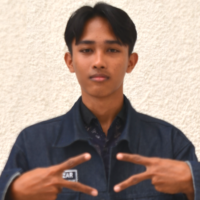 |

---

## 👥 Anggota Divisi

| Nama                         | Foto |
|------------------------------|------|
| Maulana Adiatma              | 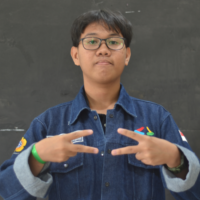 |
| Abdul 'Aziz                  | 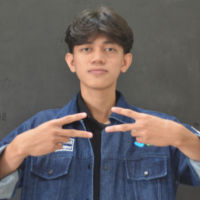 |
| M. Naufal Rafif Pratama      | 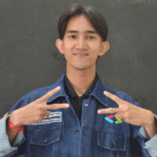 |
| Adhia Rihal Sulaiman         |  |
| Ahmad Fadhil Rizqi           | 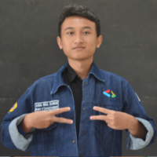 |
| Andhika Pratama              | 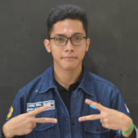 |
| Kenz Raki Abdurrazak         | 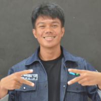 |
| Dian Kharisma Ramadhan       | 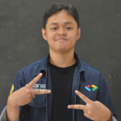 |
| Depo Sadrila Hadi            | 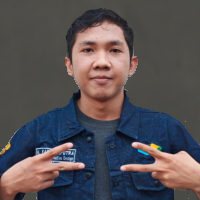 |
| Arjun Elvas Janggiara        | 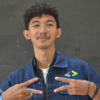 |
| Zildjian Vito Sulaiman       | 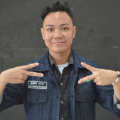 |
| Steven                       | 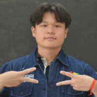 |

---

## 🛠️ Tech Stack

- **GO**
- **Fiber, GORM**
- **RESTful APIs**

---

## 🌱 Visi Kami

> Menjadi divisi yang saling berkembang dan menjadi tempat yang tepat untuk bertumbuh.

---

## 📫 Kontak

- 🌐 [Website GDGoC UNSRI](https://gdsc.community.dev/universitas-sriwijaya/)
- 📧 Email: gdgoc.unsri@gmail.com
- 📍 Universitas Sriwijaya, Palembang

---

> Made with ❤️ by Backend Development Team @ GDGoC UNSRI 2025
